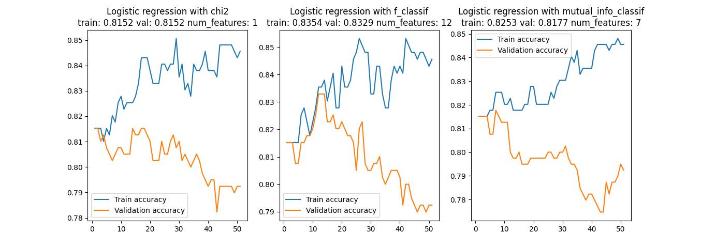
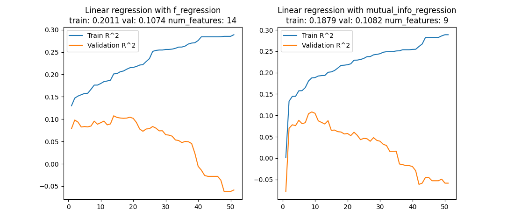

# HW4 – Team SWEg

Please consult the [homework assignment](https://cmu-313.github.io//assignments/hw4) for additional context and instructions for this code.

## pipenv

[pipenv](https://pipenv.pypa.io/en/latest) is a packaging tool for Python that solves some common problems associated with the typical workflow using pip, virtualenv, and the good old requirements.txt.

### Installation

#### Prereqs

- Python 3.8
- pip package manager is updated to latest version
- For additional resources, check out [this link](https://pipenv-fork.readthedocs.io/en/latest/install.html#installing-pipenv)

#### Mac OS

To install pipenv from the command line, execute the following:

```terminal
sudo -H pip install -U pipenv
```

#### Windows OS

The same instructions for Mac OS **should** work for windows, but if it doesn't, follow the instructions [here](https://www.pythontutorial.net/python-basics/install-pipenv-windows).

### Usage

#### Downloading Packages

The repository contains `Pipfile` that declares which packages are necessary to run the `model_build.ipnyb`.
To install packages declared by the Pipfile, run `pipenv install --dev` in the command line from the root directory.

You might want to use additional packages throughout the assignment.
To do so, run `pipenv install [PACKAGE_NAME]`, as you would install python packages using pip.
This should also update `Pipfile` and add the downloaded package under `[packages]`.
Note that `Pipfile.lock` will also be updated with the specific versions of the dependencies that were installed.
Any changes to `Pipfile.lock` should also be committed to your Git repository to ensure that all of your team is using the same dependency versions.

#### Virtual Environment

Working in teams can be a hassle since different team members might be using different versions of Python.
To avoid this issue, you can create a python virtual environment, so you and your team will be working with the same version of Python and PyPi packages.
Run `pipenv shell` in your command line to activate this project's virtual environment.
If you have more than one version of Python installed on your machine, you can use pipenv's `--python` option to specify which version of Python should be used to create the virtual environment.
If you want to learn more about virtual environments, read [this article](https://docs.python-guide.org/dev/virtualenvs/#using-installed-packages).
You can also specify which version of python you and your team should use under the `[requires]` section in `Pipfile`.

## Jupyter Notebook

You should run your notebook in the virtual environment from pipenv.
To do, you should run the following command from the root of your repository:

```terminal
pipenv run jupyter notebook
```

## API Endpoints

You should also use pipenv to run your Flask API server.
To do so, execute the following commands from the `app` directory in the pip venv shell.

Set an environment variable for FLASK_APP.
For Mac and Linux:

```terminal
export FLASK_APP=app.py
```

For Windows:

```terminal
set FLASK_APP=app
```

To run:

```terminal
pipenv run flask run
```

Or if you're in the pipenv shell, run:

```terminal
flask run
```

You can alter the port number that is used by the Flask server by changing the following line in `app/.flaskenv`:

```sh
FLASK_RUN_PORT=8000
```

After filling up decorators for each endpoint, Swagger API documentation is automatically generated and available from the `/api/docs` URL of the server. For decorator rules and examples, refer to [Flask-RESTX Swagger documentation](https://flask-restx.readthedocs.io/en/latest/swagger.html#swagger-documentation).

## Testing

To run tests, execute the following command from the `app` directory:

```terminal
pytest
```

If you're not in the Pipenv shell, then execute the following command from the `app` directory:

```terminal
pipenv run pytest
```

## Model Training

### Preprocessing

Since categorical variables do not have order nor represent magnitude, they cannot be entered into a model (especially regression) just as they are.
Thus, we first decided to preprocess the dataset using `sklearn.preprocessing.OrdinalEncoder` and `sklearn.preprocessing.OneHotEncoder` and cached the fitted encoders so that they can be used again to transform a given applicant entity on inference.

To run the preprocessing script, activate the Pipenv shell and execute the following command from the `data` directory:

```terminal
python preprocessor.py
```

Then, the encoders are exported to [`data/encoders`](https://github.com/CMU-313/fall-22-hw4-team-sweg/tree/main/data/encoders), and the preprocessed training dataset is saved as [`data/student-mat-preprocessed.csv`](https://github.com/CMU-313/fall-22-hw4-team-sweg/blob/main/data/student-mat-preprocessed.csv).

### Feature Selection

Features do not always contribute to a good model performance; some features would not show statistically significant relevance to the desired output, or too many features increase the model complexity and cause overfitting.
Instead of using all the given features, we ranked them based on different score functions (regression – `f_regression`, `mutual_info_regression`, `classification` – `chi2`, `f_classif`, `mutual_info_classif`) and selected a subset of them to train a model.
The lists of ranked features can be found in [`data/features`](https://github.com/CMU-313/fall-22-hw4-team-swag/tree/main/data/features).

We experimented to find an optimal combination of (model class, score function, number of features) that yields the best model. With 5-fold cross validation, the result is as follows:





Our best model used a logistic regression with 12 features ranked by the `f_classif` function. The training accuracy was 83.54%, and the validation accuracy was 83.29%, much higher than the baseline model.
